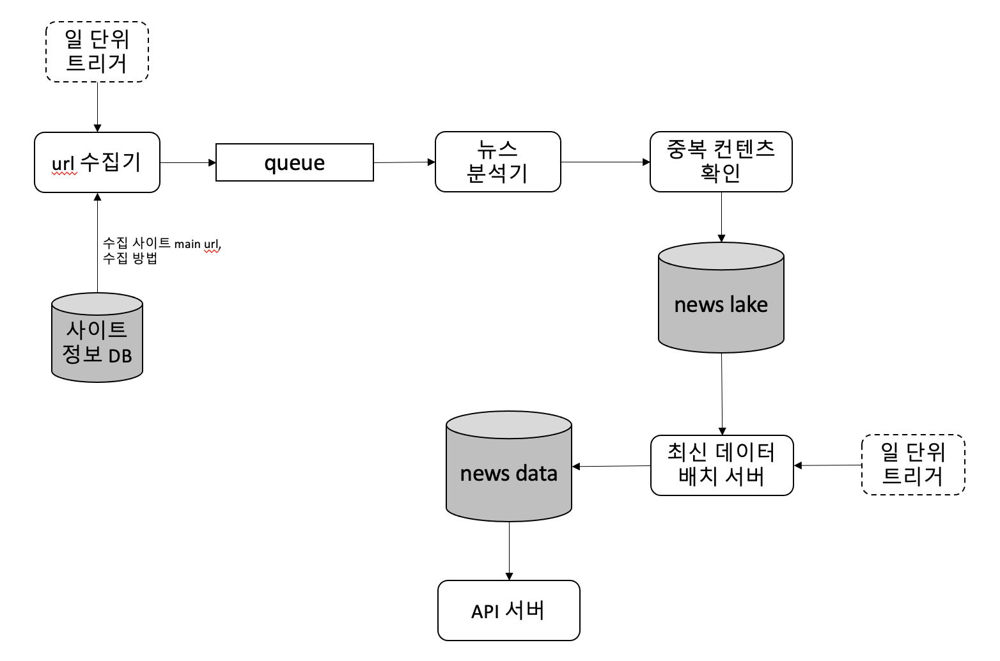

# newsbot

# 1. 기획

## 1.1 아이디어

- **특정 동향을 파악하기 위한** 뉴스 모니터링, 뉴스 클리핑 서비스는 많으나, (구글 알리미, 플립보드, 잔디, 디그, 피들리, 스크랩 마스터 등)

- 카카오톡으로 전달하기 위한 하나의 "메시지" 형식으로 만드는 서비스는 없거나 또는 유료임(스크랩 마스터)

- 하지만 소규모 비즈니스, 단체에서는 주로 카카오톡 또는 메신저를 통해 그날 기사를 요약, 전달하는 경우가 많음

  - ```
    ['24. 2. 15.(목), 아침 언론 참고]
    
    <국방(육군) 관련>
    
    ■ 한·미 국방부, 핵협의그룹 주관…北 도발 땐 美 핵무기 공동 운용(서울, 세계, 조선 등)
    https://naver.me/xC17Bo84
    *NCG 제도화·정례화, 방위비 분담금 협상 조기착수 등 ‘트럼프 리스크’ 대비 
    
    ■ 北, 김정일 생일 앞두고 또 순항미사일 발사…올들어 5번째(동아, 서울, 세계 등)
    https://naver.me/GRm4oB1w
    *연초부터 순항미사일 연쇄발사 이례적...기술적 신뢰성 확보 및 ‘러시아 판매용’ 등 관측 
    
    ...
     
    <안보·북한·외교 관련>
    
    ■ 한국, ‘北 형제국’ 쿠바와 전격 수교, 193번째 수교국(전매체)
    https://naver.me/xoY8HsRr
    *외교부 “중남미 정책 대전환 계기”…北 외교적 고립 심화 및 대북 압박전선 강화 기대
    
    ■ 김성한 前 안보실장 “한미, ‘워싱턴 선언’ 당시 한반도 전술핵 재배치 옵션도 논의”(동아)
    https://naver.me/xoY8H6WE
    *NCG창설 및 전술 핵무기 배치 놓고 의견교환…대통령실 “논의한 적 없다” 부인
    
    ...
    ```

- 클리핑 서비스에서 주제에 대한 당일 기사를 가져와도 메시지 형태로 변환하는 작업이 필요함

- 따라서 특정 주제 또는 여러 주제를 입력했을 때 메신저로 만들어주는 뉴스봇이 수요가 있을 것이라고 판단함

## 1.2 개발 기간 및 리소스

- 개발 기간
  - 목표 : 2달 (서비스 공부 기간 포함)
  - 실제 : 
- 리소스 
  - 목표 : AWS 비용 $80/월 미만
  - 실제 : 

# 2. 사용 기술

*프로젝트 목적의 대부분은 기술 습득이기 때문에 오버 엔지니어링일 수 있습니다.*

- CI/CD, 형상관리 : gitlab, github 
- Infra
  - AWS, docker, k8s (k8s 서버 구성 후 EKS 로 이전)
  - terraform, ansible
- server
  - web server : react?
  - API server : kotlin + spring
  - 뉴스 크롤링 : python
- DB
  - postgresql (or mongoDB or dynamoDB)
- 모니터링 서비스
  - prometheus + grafana

# 3. 아키텍처

## 3.1 문제 설계 범위

- 대상 뉴스 페이지 선정 : 
  - 일 00개 수집 필요
  - 3일치만 저장
  - 중복 컨텐츠는 개수 증가로 표시

## 3.2 아키텍처 설계



# 4. 서비스 페이지

# 5. 주요 기술 설명

# 6. 마무리

